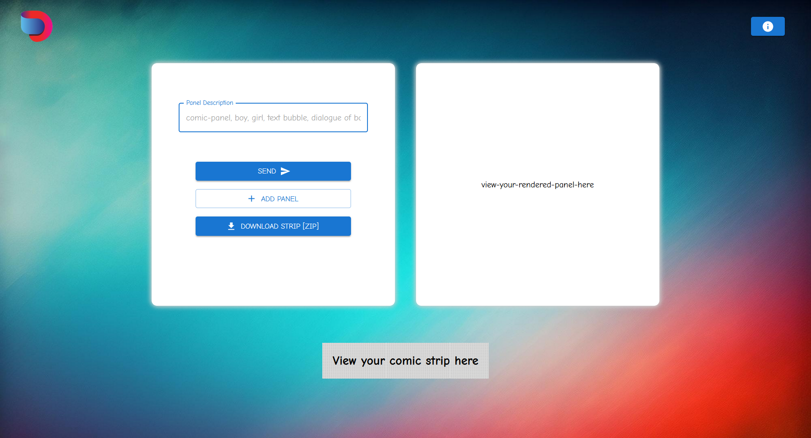
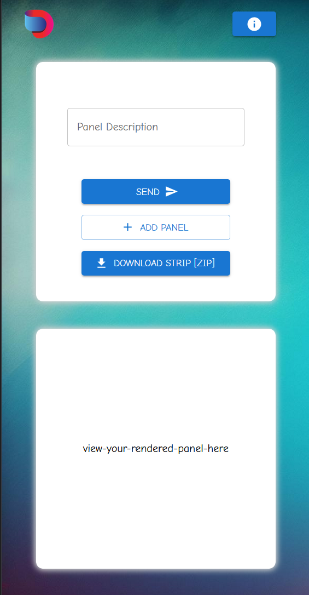
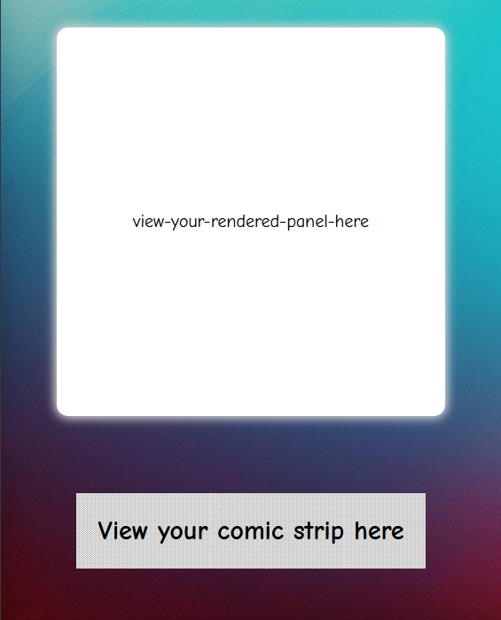

# Comic Creater Web App [Engineer, Product, Dashtoon]

This is my submission for the Dashtoon Product Engineer role [Comic Creater Web App](https://dashtoon-comic-api.vercel.app/)

## Live Demo

Users can describe their comic panel in a detailed manner. The Gen AI supporting this app creates an image for the comic panel.

1. Describe your panel image. Provide dialogous, character descriptions, actions etc.
2. Hit "Send". Wait for the image to render on the side-board.
3. In case you wish to make changes, change the text and hit again.
4. Press "Add Panel" to add the image to the comic strip at the bottom of the page.
5. Design as many panels you wish to make!!🫡🫡

## Screenshots



This app is fully reponsive




## Run Locally

Clone the project

```bash
  git clone https://github.com/no-logik/dashtoon-comic-api
```

Go to the project directory

```bash
  cd my-project
```

Install dependencies

```bash
  npm install
```

Start the server

```bash
  npm run start
```
